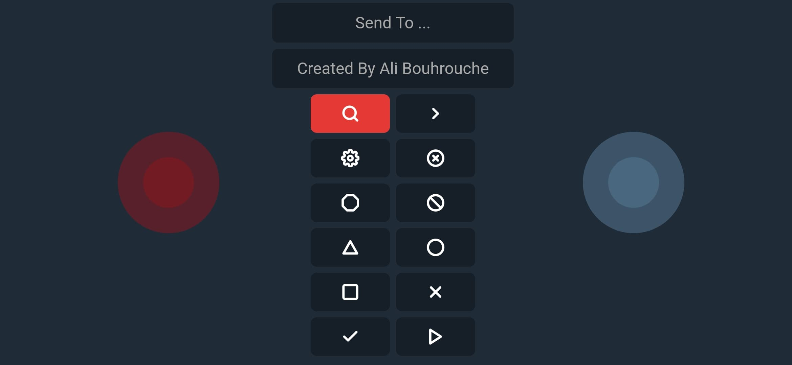

# Remote-Controller
A Remote Controller For An Arduino Robot https://ali.js.org/RC

## Why
This Project Was Created To Remotely control an Arduino Robot for a competition under Robotics FSR Club that was canceled due to covid-19 spread in Morocco.

## Features 
1. Optimized For Fast And Accurate Controlling
2. 2 seperate joystick like controllers
3. 10 speed level for each controller determined based on swipe force
4. Ready to go Arduino Code for 2 or 4 servo motors
5. 8 reconfigurable buttons for extra features (support long press)
6. Send any text to Bluetooth Devices
7. Receive Bluetooth Serial Output on Screen
8. Support All Capable Smartphones (Android with Bluetooth SPP Support)
9. Support any SPP Capable Device

## Commands
### For Left Controller
- F : Forward
- B : Backward
- R : Right
- L : Left
- I : Forward Right
- G : Forward Left
- J : Backward Right
- H : Backward Left
- S : Stop
- 0 : Speed 0%
- 1 : Speed 10%
- 2 : Speed 20%
- 3 : Speed 30%
- 4 : Speed 40%
- 5 : Speed 50%
- 6 : Speed 60%
- 7 : Speed 70%
- 8 : Speed 80%
- 9 : Speed 90%
- q : Speed 100%
### For Right Controller 
- f : Forward
- b : Backward
- r : Right
- l : Left
- i : Forward Right
- g : Forward Left
- j : Backward Right
- h : Backward Left
- s : Stop
- Z : Speed 0%
- O : Speed 10%
- T : Speed 20%
- C : Speed 30%
- U : Speed 40%
- E : Speed 50%
- e : Speed 60%
- N : Speed 70%
- t : Speed 80%
- n : Speed 90%
- Q : Speed 100%
### For Buttons
- **⎔** : Send '!'
- **⦸** : Send 'D'
- **Δ** : Send 'a'
- **◯** : Send 'c'
- **⎕** : Send 'y'
- **×** : Send 'z'
- **✓** : Send '-'
- **ᐅ** : Send '+'
